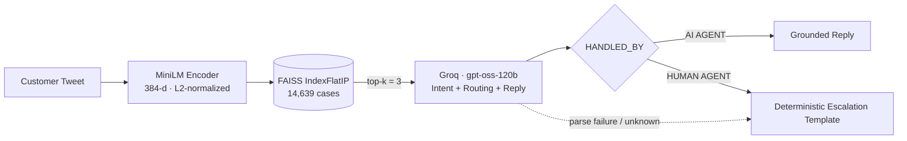

<div align="center">

<!-- 🎨 DROP-IN ASSET: logo (recommended 240×240, transparent PNG) -->


# ⚙️ SPOTIFYCARES · AI SUPPORT ENGINE

### `RETRIEVE → REASON → ROUTE`

**Grounded retrieval and adaptive reasoning for automated customer care, with deterministic human escalation.**

<br/>


**HIVER · SDE INTERN TAKE-HOME ASSIGNMENT**

</div>

---

> ### 📋 EXECUTIVE SUMMARY
>
> SpotifyCares is a **tiered NLP system** that ingests raw customer tweets and returns a structured decision: **intent**, **handling route (`AI AGENT` vs `HUMAN AGENT`)**, and a **grounded customer-facing reply**.
>
> The system was built as three deliberately incremental baselines over **14,639 historical Spotify support interactions**. It starts with a lexical retrieval matcher, moves to a supervised intent classifier, and ends in a **Retrieval-Augmented Generation (RAG) agent** that pairs FAISS semantic search with an LLM reasoning layer.
>
> The core design principle: **the model never owns anything it can hallucinate.** Historical cases are *evidence, not truth*. Escalation contact details are injected by Python, not generated. Every parse failure resolves *toward* a human, never away from one.

---

## 🗂️ TABLE OF CONTENTS

| # | Module | # | Module |
|:-:|:--|:-:|:--|
| 01 | [Mission Brief](#-01--mission-brief) | 06 | [Business Impact](#-06--business-impact) |
| 02 | [System Evolution](#-02--system-evolution) | 07 | [Setup & Usage](#-07--setup--usage) |
| 03 | [Tier 1 · Char-Level Similarity Matcher](#-03--tier-1--character-level-similarity-matcher) | 08 | [Project Structure](#-08--project-structure) |
| 04 | [Tier 2 · TF-IDF + Logistic Regression](#-04--tier-2--tf-idf--logistic-regression) | 09 | [Live Runs](#-09--live-runs) |
| 05 | [Tier 3 · FAISS + Groq RAG Agent](#-05--tier-3--faiss--groq-rag-agent) | 10 | [Evaluation Integrity & Roadmap](#-10--evaluation-integrity--roadmap) |

---

## 🎯 01 · MISSION BRIEF

Support teams drown in a mix of genuinely actionable tickets and conversational noise. A useful automation layer needs to answer three questions, **independently**:

1. **What is the customer actually asking?** (intent)
2. **Can software safely resolve it?** (routing)
3. **If so, what should we say?** (grounded generation)

| ✅ In Scope | 🚫 Explicitly Out of Scope |
|:--|:--|
| **Evidence-based grounding.** Historical cases inform replies but are never treated as absolute truth. | **Direct action systems.** No refund engine, no backend account mutation. |
| **Intent-aware responses.** Address the underlying problem, not surface keywords. | **Static rule trees.** No hardcoded "billing → human" routing for whole intent classes. |
| **Decoupled safety escalation.** AI-vs-human is a separate decision from intent. | **Generator fine-tuning.** RAG plus prompt logic only, no custom-trained generator. |

---

## 🧬 02 · SYSTEM EVOLUTION

Each tier exists because the previous one exposed a specific limitation.

```text
┌────────────────────┐      ┌─────────────────────┐      ┌───────────────────────────┐
│  BASELINE 1        │      │  BASELINE 2         │      │  BASELINE 3 (PRODUCTION)  │
│  Char TF-IDF 1-NN  │ ───▶ │  Word TF-IDF + LR   │ ───▶ │  FAISS + Groq RAG Agent   │
├────────────────────┤      ├─────────────────────┤      ├───────────────────────────┤
│ OUT: historical    │      │ OUT: intent label   │      │ OUT: intent + route +     │
│      reply         │      │      + confidence   │      │      grounded reply       │
│ ✗ no intent        │      │ ✗ no reply          │      │ ✓ semantic retrieval      │
│ ✗ no routing       │      │ ✗ no routing        │      │ ✓ reasoned routing        │
│ ✗ lexical only     │      │ ✗ collapses to      │      │ ✓ deterministic guardrail │
│                    │      │   majority class    │      │                           │
└────────────────────┘      └─────────────────────┘      └───────────────────────────┘
```

**Why the architecture evolved.** Baselines 1 and 2 are *complementary halves of a solution*. One can find a reply but cannot classify; the other can classify but cannot reply. Neither can decide **whether a machine should be answering at all**. That last question is fundamentally a reasoning problem over context ("has troubleshooting already failed?", "is account-specific investigation required?", "did the customer ask for a human?"). It does not reduce to a feature-space decision boundary, which is why Tier 3 hands it to an LLM, grounded by retrieval and fenced by deterministic guardrails.

### System Blueprint (Tier 3)



<!-- 🎨 DROP-IN ASSET: exported architecture diagram (e.g. from the project deck, slide 3) -->


---

## 🔤 03 · TIER 1 · CHARACTER-LEVEL SIMILARITY MATCHER

> **Notebook:** [`Baseline_1_Hiver_.ipynb`](notebooks/Baseline_1_Hiver_.ipynb)

A zero-training, nearest-neighbour retriever: given a new tweet, return the **actual historical Spotify reply** attached to its closest historical customer tweet.

| Component | Configuration |
|:--|:--|
| Vectorizer | `TfidfVectorizer(analyzer="char", ngram_range=(3, 5))` |
| Corpus | 14,639 historical customer tweets (rows with null tweet/reply dropped) |
| Similarity | Cosine, brute-force `argmax` over the sparse matrix |
| Output | Historical reply + matched tweet + historical intent + similarity score |

Character n-grams make the matcher **robust to typos, truncation, and tokenization noise**, all of which are endemic in tweet data:

```text
NEW CUSTOMER TWEET   : doesn t work and i even tried
MOST SIMILAR TWEET   : doesn t work and i even tried deleting the app
HISTORICAL REPLY     : hmm can you try restarting your device by holding the sleep wake volume down buttons ...
INTENT               : app_technical_issue
SIMILARITY           : 0.7878
```

**Where it breaks:** matching is purely surface-form. Paraphrases with no shared character n-grams are invisible to it, it produces no intent, and it will confidently return an irrelevant reply for casual chit-chat that merely looks like a past tweet.

---

## 📊 04 · TIER 2 · TF-IDF + LOGISTIC REGRESSION

> **Notebook:** [`Baseline_2_Hiver_.ipynb`](notebooks/Baseline_2_Hiver_.ipynb)

A supervised intent classifier across the **12-class taxonomy**.

| Component | Configuration |
|:--|:--|
| Split | `train_test_split(test_size=0.20, random_state=42, stratify=y)` → **11,711 train / 2,928 test** |
| Features | `TfidfVectorizer(ngram_range=(1, 2), min_df=2, max_df=0.95)` → **18,599-term vocabulary** |
| Model | `LogisticRegression(max_iter=1000, random_state=42)` |

### Results on the 2,928-example held-out set

| Metric | Value |
|:--|:-:|
| **Accuracy** | **0.8108** |
| Majority-class baseline (`other`, 1,375 / 2,928) | 0.4696 |
| Weighted avg P / R / F1 | 0.82 / 0.81 / 0.78 |
| **Macro avg P / R / F1** | **0.79 / 0.39 / 0.44** |

<details>
<summary><b>▸ Full per-class classification report</b></summary>

<br/>

| Intent | Precision | Recall | F1 | Support |
|:--|:-:|:-:|:-:|:-:|
| `app_technical_issue` | 0.81 | 0.83 | 0.82 | 633 |
| `audio_quality_issue` | 1.00 | 0.04 | 0.08 | 51 |
| `billing_payment` | 0.95 | 0.45 | 0.61 | 86 |
| `cancellation_request` | 1.00 | 0.07 | 0.13 | 14 |
| `complaint` | 0.00 | 0.00 | 0.00 | 20 |
| `feature_question` | 0.88 | 0.39 | 0.54 | 127 |
| `login_account_issue` | 0.87 | 0.70 | 0.77 | 165 |
| `missing_unavailable_content` | 0.50 | 0.04 | 0.07 | 27 |
| `other` | 0.79 | 0.99 | 0.88 | 1,375 |
| `playback_issue` | 0.87 | 0.79 | 0.83 | 335 |
| `playlist_issue` | 1.00 | 0.13 | 0.23 | 39 |
| `premium_subscription` | 0.87 | 0.23 | 0.37 | 56 |

</details>

### Reading the numbers like an engineer

The headline 81% is real but **misleading on its own**. The gap between weighted F1 (0.78) and macro F1 (0.44) is the story:

- **Majority-class gravity.** `other` alone is ~47% of the data. Recall on `other` is 0.99 while recall on eight of the eleven remaining classes sits **below 0.5**. The misclassification mass in the confusion matrix flows overwhelmingly into `other` (e.g. 101 `app_technical_issue`, 69 `feature_question`, 29 `billing_payment` and 27 `audio_quality_issue` test tweets were predicted as `other`).
- **High-precision, low-recall minority classes.** `audio_quality_issue`, `cancellation_request`, and `playlist_issue` all hit precision 1.00 with recall of 0.04–0.13. The model is right *when it speaks*, but rarely speaks. No `class_weight` was applied, and that is a deliberate baseline choice, not an oversight.
- **A bag-of-words ceiling.** Bigrams cannot resolve *"I'll cancel if you can't fix playback"*, which is a playback problem wearing a cancellation costume. This is the semantic-intent gap that motivates Tier 3.

Sanity probe: `"my spotify keeps stopping when I play songs"` → `playback_issue` @ 0.9293 confidence.

---

## 🧠 05 · TIER 3 · FAISS + GROQ RAG AGENT

> **Notebook:** [`Baseline_3_Hiver_.ipynb`](notebooks/Baseline_3_Hiver_.ipynb) · **This is the primary entry point.**

### Pipeline

| Step | Stage | Implementation |
|:-:|:--|:--|
| **01** | Encode | `all-MiniLM-L6-v2` → 384-d vectors, `normalize_embeddings=True`, `float32` |
| **02** | Index | `faiss.IndexFlatIP(384)`; inner product over unit vectors is exactly cosine similarity; 14,639 cases indexed |
| **03** | Retrieve | Top-**3** nearest historical cases (`customer_tweet`, `spotify_reply`, `similarity`, `historical_intent`) |
| **04** | Reason | `openai/gpt-oss-120b` via Groq, `temperature=0.2`, `max_tokens=350` |
| **05** | Parse | Regex extraction of `INTENT`, `HANDLED_BY`, `REASON`, `REPLY` from a fixed output contract |
| **06** | Guardrail | If `HUMAN AGENT`: **discard the model's reply** and substitute a fixed escalation template |

### The Prompt Contract

The LLM is given the customer message, the 3 retrieved cases (with similarity scores), and the 12 intent definitions, then must emit exactly:

```text
INTENT: <intent>
HANDLED_BY: <AI AGENT or HUMAN AGENT>
REASON: <short reason>
REPLY: <customer-facing response>
```

Behavioural rules encoded in the prompt:

| Concern | Rule |
|:--|:--|
| **Intent** | Classify the *underlying problem*, not keywords. A cancellation threat wrapped around a playback failure is `playback_issue`. |
| **Routing is decoupled from intent** | *Any* intent may go to *either* handler. `other`, billing, cancellation, or account mentions are explicitly **not** sufficient grounds to escalate. |
| **→ `AI AGENT`** | Clear problem · useful guidance available · no account-specific investigation · informational or casual message. |
| **→ `HUMAN AGENT`** | Explicit human request · prior troubleshooting failed · account investigation or manual action needed · unusual or unsafe to auto-resolve. |
| **Anti-hallucination** | Must not invent refunds, account changes, policies, prices, guarantees, or actions not performed. Historical replies are references, never copied blindly. |

### Fail-Closed Guardrails

```python
# Parse defaults: every ambiguity resolves toward a human
intent     = "other"                    # unless a valid taxonomy label is parsed
handled_by = "HUMAN AGENT"              # unless AI AGENT is explicitly parsed
reason     = "Additional review is required."

# Deterministic escalation: the LLM never authors contact details
if handled_by == "HUMAN AGENT":
    reply = ("Thanks for reaching out. This issue requires additional assistance "
             "from our customer support team. Please contact Spotify Customer Care "
             f"at {CUSTOMER_CARE_NUMBER} for further help.")
```

### Key Design Decisions

| Decision | Rationale |
|:--|:--|
| **Decoupled safety routing** | Intent and AI-vs-human are separate judgments; coupling them recreates a brittle rule tree. |
| **Python-owned contact details** | Eliminates hallucinated phone numbers, the highest-severity failure in a support context. |
| **Reference-only retrieval** | Semantically similar tweets can carry poor historical answers; the LLM adapts rather than parrots. |
| **Top-3 context cap** | Bounds prompt length, latency, cost, and retrieval noise. |
| **Exact search (`IndexFlatIP`)** | At 14.6K vectors brute-force is sub-linear-irrelevant, and it gives exact recall. ANN (IVF/HNSW) becomes worthwhile only at orders-of-magnitude larger corpora. |
| **Taxonomy validation on parse** | An LLM-invented label can never leak downstream; unknown intents fall back to `other`. |
| **Low temperature (0.2)** | Routing decisions should be near-deterministic. |

---

## 💼 06 · BUSINESS IMPACT

Support cost is driven by **agent-minutes**. The value of this architecture lies in spending them only where a human is genuinely irreplaceable.

| Lever | Mechanism | Effect |
|:--|:--|:--|
| **🎯 Ticket deflection** | Clear, informational, and troubleshooting-tier queries resolve via `AI AGENT` with grounded replies. | Human queue shrinks to cases requiring judgment or account access. |
| **🗑️ Noise absorption** | Under the provisional labels, roughly **47%** of the corpus is `other`: greetings, appreciation, casual chatter. The agent is explicitly instructed **not** to escalate these. | Removes the largest single source of low-value human work. |
| **🛡️ Risk containment** | Human-only contact details, no invented refunds/policies, fail-closed parsing. | A wrong AI answer becomes an *escalation*, not a liability. |
| **⚡ Faster first response** | Retrieval + a single LLM call (Groq inference) replaces queue wait for the AI-eligible share. | Lower time-to-first-response on deflected tickets. |
| **🔁 Institutional memory** | 14.6K historical resolutions become a queryable knowledge base, so new hires' best answers are yesterday's veterans' answers. | Consistency and faster ramp. |

**Back-of-envelope model** (substitute your own operational numbers):

```text
Monthly savings ≈ tickets/month × deflection_rate × avg_handle_minutes × loaded_cost_per_minute
                  − (LLM + infra cost per ticket × tickets/month)
```

> ⚠️ **No deflection rate or dollar figure is claimed here.** Quantifying real impact requires the human-labelled golden set described in [§10](#-10--evaluation-integrity--roadmap).

---

## 🛠️ 07 · SETUP & USAGE

### Prerequisites

- Python **3.10+**
- A **[Groq API key](https://console.groq.com/keys)** (Tier 3 only; Tiers 1 and 2 run fully offline)
- The dataset `spotify_customer_classifiedtwice.csv` with columns `customer_tweet`, `spotify_reply`, `intent`

### 1 · Environment

```bash
git clone https://github.com/<your-username>/<your-repo>.git
cd <your-repo>

python -m venv .venv
source .venv/bin/activate          # Windows: .venv\Scripts\activate

pip install groq sentence-transformers faiss-cpu pandas scikit-learn jupyter
```

### 2 · Data

```bash
mkdir -p data
# place the dataset here:
#   data/spotify_customer_classifiedtwice.csv
```

> The notebooks were authored on Google Colab and read from `/content/spotify_customer_classifiedtwice.csv`. When running locally, update the `pd.read_csv(...)` / `DATA_PATH` line in each notebook to `data/spotify_customer_classifiedtwice.csv`.

### 3 · Configure Groq

```bash
# macOS / Linux
export GROQ_API_KEY="gsk_your_key_here"

# Windows (PowerShell)
$env:GROQ_API_KEY = "gsk_your_key_here"
```

The notebook prompts for the key interactively via `getpass`. To read it from the environment instead, swap the client initialisation cell for:

```python
import os
from groq import Groq

client = Groq(api_key=os.environ["GROQ_API_KEY"])
MODEL = "openai/gpt-oss-120b"
```

### 4 · Run

```bash
jupyter notebook notebooks/Baseline_3_Hiver_.ipynb   # 🚀 primary: RAG agent
jupyter notebook notebooks/Baseline_2_Hiver_.ipynb   # supervised classifier + metrics
jupyter notebook notebooks/Baseline_1_Hiver_.ipynb   # lexical similarity matcher
```

Or open any notebook directly in **Google Colab** with zero local setup.

### 5 · Call the Agent

Once the Tier 3 cells have run, the pipeline is a single function call:

```python
result = support_agent(
    "my spotify music keeps stopping and restarting the app didn't help",
    top_k=3,
)

print(result["intent"])        # e.g. "playback_issue"
print(result["handled_by"])    # "AI AGENT" | "HUMAN AGENT"
print(result["reason"])        # short routing rationale
print(result["reply"])         # customer-facing response
print(result["historical_cases"])  # the retrieved evidence, for auditability
```

---

## 🏗️ 08 · PROJECT STRUCTURE

```text
📦 spotifycares-ai-support
 ┃
 ┣ 📂 notebooks
 ┃ ┣ 📓 Baseline_1_Hiver_.ipynb     ← Char TF-IDF (3–5) · cosine 1-NN reply matcher
 ┃ ┣ 📓 Baseline_2_Hiver_.ipynb     ← Word TF-IDF (1–2) + LogReg · 12-class intent classifier
 ┃ ┗ 📓 Baseline_3_Hiver_.ipynb     ← MiniLM + FAISS + Groq · RAG agent  ★ primary
 ┃
 ┣ 📂 data
 ┃ ┗ 📄 spotify_customer_classifiedtwice.csv   ← customer_tweet · spotify_reply · intent
 ┃
 ┣ 📂 docs
 ┃ ┣ 📊 SpotifyCares_AI_Customer_Support_Agent_Presentation.pptx
 ┃ ┗ 📂 assets
 ┃   ┣ 🖼️ logo.png               ← drop-in
 ┃   ┣ 🖼️ architecture.png       ← drop-in
 ┃   ┣ 🖼️ demo-ai-route.png      ← drop-in
 ┃   ┗ 🖼️ demo-human-route.png   ← drop-in
 ┃
 ┣ 📄 requirements.txt
 ┗ 📄 README.md
```

<details>
<summary><b>▸ requirements.txt</b></summary>

```text
groq
sentence-transformers
faiss-cpu
pandas
scikit-learn
jupyter
```

</details>

---

## 🔬 09 · LIVE RUNS

### 09.1 · Semantic retrieval (Tier 3, `top_k=3`)

Query: `"my spotify music keeps stopping"`

| Rank | Historical Customer Tweet | Historical Intent | Cosine |
|:-:|:--|:--|:-:|
| 1 | *my spotify premium thing just stopped working* | `playback_issue` | 0.787 |
| 2 | *this problem has continually happened for the past days and i m a little sick of restarting my phone…* | `app_technical_issue` | 0.784 |
| 3 | *i deleted spotify and downloaded it again but it s still doing the same thing* | `app_technical_issue` | 0.782 |

Note that the top-3 scores differ by **0.005**. Retrieval surfaces the right *neighbourhood* but not a decisive winner, which is precisely why the LLM treats them as evidence to synthesise rather than answers to copy.

### 09.2 · Explicit human-escalation request

Query: `"i have a problem with my spotify music ci want to talk to my spotify support team"`

```text
======================================================================
SPOTIFY CUSTOMER SUPPORT AGENT
======================================================================
Predicted Intent : other
Handled By       : HUMAN AGENT
Reason           : Additional review is required.

Spotify Reply:
Thanks for reaching out. This issue requires additional assistance from our
customer support team. Please contact Spotify Customer Care at <CUSTOMER_CARE_NUMBER>
for further help.
======================================================================
```

> **Engineering note:** in this recorded run the raw LLM response body was **empty**, so the parser's fail-closed defaults (`other` / `HUMAN AGENT` / *"Additional review is required."*) fired. The outcome (escalating a customer who asked for a human) is correct, but the intent and reason shown are **fallback values, not model output**. See the reasoning-budget item in [§10](#-10--evaluation-integrity--roadmap).

<!-- 🎨 DROP-IN ASSETS: terminal / notebook screenshots of each route -->
| AI-Resolved Route | Human-Escalated Route |
|:-:|:-:|
|  |  |

---

## 🧪 10 · EVALUATION INTEGRITY & ROADMAP

### What is and is not proven

| Claim | Status |
|:--|:--|
| Tier 2 intent accuracy of 0.8108 (macro-F1 0.44) on 2,928 held-out tweets | ✅ Measured, but against **provisional labels** |
| Tier 1 retrieval quality | ⚠️ Qualitative spot checks only, no quantitative metric |
| Tier 3 routing and reply quality | ⚠️ Qualitative only, **not yet benchmarked** |
| Tier 3 outperforms Tiers 1 and 2 | ❌ **Not claimed.** The tiers output different things and share no common gold set yet |

**Why headline accuracy can mislead here:**

- **Provisional labels.** The `intent` column was auto-generated without human verification, so Tier 2 accuracy measures agreement with a labeller, not with reality.
- **Near-duplicate bias.** Identical or near-identical historical tickets inflate retrieval scores without demonstrating generalisation.
- **Intent ≠ answer quality.** Classification accuracy says nothing about reply correctness, tone, or grounding.

### Observed failure modes

| # | Failure Mode | Mitigation Direction |
|:-:|:--|:--|
| 1 | **Casual / non-support messages** match past tweets exactly ("okay dad love you") and must not trigger escalation | Prompt rule + `other` handling already in place |
| 2 | **Keyword cancellation traps**: cancellation threats wrapped around a real playback/billing problem | Underlying-problem classification rule |
| 3 | **Historical response mismatch**: similar tweet, poor historical answer | Reference-only retrieval; retrieval relevance filtering |
| 4 | **Under-specified complaints** ("doesn't work") lack context for safe troubleshooting | Route to clarification or human when evidence is thin |
| 5 | **Noisy source data** and provisional labels | Human golden set |
| 6 | **Empty or truncated LLM output**: `gpt-oss-120b` is a reasoning model, and a tight `max_tokens=350` budget is a plausible cause of empty completions | Raise the completion budget / reasoning-effort setting, add a bounded retry before falling to the fail-closed path, log parse-fallback rate |

### 🗺️ One-Week Hardening Plan

| Days | Workstream | Deliverable |
|:-:|:--|:--|
| **1–2** | **Human golden set** | 150–250 hand-labelled examples: ground-truth intent, routing decision, answer utility |
| **3** | **Unified benchmarking** | Majority baseline vs. LogReg vs. retrieval-only vs. RAG on the *same* gold set |
| **4** | **Retrieval quality** | Recall@3, similarity thresholding, relevance filtering to prune misleading matches |
| **5** | **LLM-as-judge** | Rubric scoring for correctness, tone, and grounding |
| **6–7** | **Failure-driven optimisation** | Deduplication, tighter escalation logic, class-weighted Tier 2, latency and cost tracking |

---

<div align="center">

### 🧾 BUILT BY

**Harsha** · Hiver SDE Intern Take-Home

[](https://github.com/<your-username>)
[](https://linkedin.com/in/<your-profile>)

<sub>Grounded Support · Safe Escalation · Transparent Metrics</sub>

</div>
